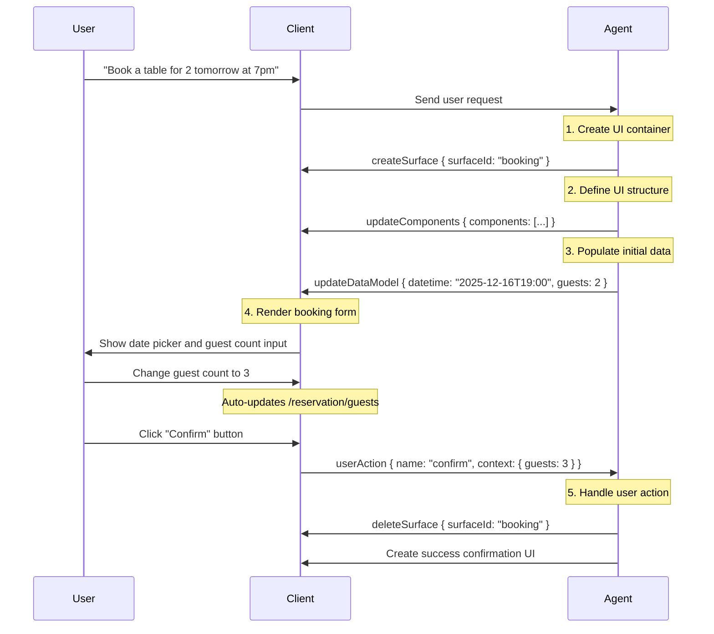

`@antdv-next/x-card` is a dynamic card rendering component based on the [A2UI protocol](https://a2ui.org/concepts/data-flow/), enabling AI Agents to dynamically build and render interactive Vue component trees through structured JSON message streams.

## What is A2UI?

A2UI (Agent-to-User Interface) is an open protocol that allows AI Agents to describe interaction intent through declarative JSON message sequences, which the frontend runtime dynamically renders into native UI components.

### Core Design Principles

A2UI is built on three core ideas:

1. **Streaming Messages**: UI updates flow from the Agent to the client as a sequence of JSON messages
2. **Declarative Components**: UI is described as data, not code
3. **Data Binding**: UI structure is decoupled from application state, enabling reactive updates

### Why A2UI?

Unlike traditional approaches where AI generates HTML directly, A2UI uses structured data streams with significant advantages:

| Feature                 | A2UI                                                                       | AI-generated HTML                                               |
| ----------------------- | -------------------------------------------------------------------------- | --------------------------------------------------------------- |
| **Security**            | Only uses predefined component catalog, no code execution risk             | May contain malicious scripts, injection risk                   |
| **Cross-platform**      | One data structure auto-adapts to Web, mobile, and other native components | HTML requires extra adaptation per platform                     |
| **Streaming Rendering** | Supports progressive rendering for smooth UX                               | Requires complete response before rendering                     |
| **LLM-friendly**        | Flat JSON structure supports incremental generation, reduces AI burden     | Requires generating full HTML structure, prone to syntax errors |
| **Maintenance**         | Components managed centrally, updates only require client library changes  | Each HTML interface needs individual debugging                  |

## Data Flow Architecture

A2UI follows the unidirectional data flow principle, ensuring predictable data direction:

```
Agent (LLM) → A2UI Generator → Transport (SSE/WebSocket/A2A)
                    ↓
Client (Stream Reader) → Message Parser → Renderer → Native UI
```

### Data Flow Lifecycle

Using a restaurant booking as an example:



## Protocol Versions

`@antdv-next/x-card` supports both v0.8 and v0.9 of the A2UI protocol. Understanding the differences helps you choose the right version and migrate if needed.

### Version Comparison

| Feature                  | v0.8                                           | v0.9                             |
| ------------------------ | ---------------------------------------------- | -------------------------------- |
| **Version field**        | No explicit version field                      | Explicit `version: 'v0.9'` field |
| **Surface creation**     | Implicit (auto-created on first surfaceUpdate) | Explicit `createSurface` command |
| **Data model update**    | Uses `contents` array (valueString/valueMap)   | Uses `path` and `value` fields   |
| **Component definition** | Nested inside `component: { Name: { ... } }`   | Flat `component: 'Name'`         |
| **Recommendation**       | Compatibility for legacy Agents                | **Recommended**                  |

### v0.8 Message Format

v0.8 uses implicit Surface creation and wraps component props inside an object keyed by the component type:

```typescript
// v0.8 has no explicit version field
{
  surfaceUpdate: {
    surfaceId: 'booking',
    components: [
      {
        id: 'root',
        component: {
          Column: {
            children: { explicitList: ['header', 'content'] },
          },
        },
      },
    ],
  },
}
```

**Data model updates** use the `contents` array (values are encoded as strings):

```typescript
{
  dataModelUpdate: {
    surfaceId: 'booking',
    contents: [
      { key: 'guests', valueString: '3' },
    ],
  },
}
```

### v0.9 Message Format (Recommended)

v0.9 introduces explicit version identification and a Surface creation command, making the protocol clearer and more controllable:

```typescript
// Explicitly create Surface
{
  version: 'v0.9',
  createSurface: {
    surfaceId: 'booking',
    catalogId: 'local://booking-catalog.json',
  },
}

// Update components
{
  version: 'v0.9',
  updateComponents: {
    surfaceId: 'booking',
    components: [
      { id: 'root', component: 'Column', children: ['header', 'content'] },
    ],
  },
}
```

**Data model updates** use the more intuitive `path` and `value` fields:

```typescript
{
  version: 'v0.9',
  updateDataModel: {
    surfaceId: 'booking',
    path: '/reservation/guests',
    value: 3,
  },
}
```

### Backward Compatibility

`@antdv-next/x-card` supports both versions in the same command stream. The runtime auto-detects protocol version based on the presence of the `version` field:

```ts
import { XCardBox } from "@antdv-next/x-card";

const commands = [
  // v0.8 message
  {
    surfaceUpdate: {
      /* ... */
    },
  },

  // v0.9 message
  {
    version: "v0.9",
    createSurface: {
      /* ... */
    },
  },
];
```

## Core Message Types

`@antdv-next/x-card` fully implements the A2UI v0.9 core command system:

### 1. createSurface — Create UI Container

Creates a new UI container (Surface). Each Surface has its own independent component tree and data model.

```ts
{
  version: "v0.9",
  createSurface: {
    surfaceId: "booking",
    catalogId: "local://booking-catalog.json",
  },
}
```

### 2. updateComponents — Update Component Structure

Defines or updates UI components in a Surface using the adjacency list model.

```ts
{
  version: "v0.9",
  updateComponents: {
    surfaceId: "booking",
    components: [
      { id: "root", component: "Column", children: ["header", "guests-field", "submit-btn"] },
      { id: "header", component: "Text", text: "Confirm Reservation", variant: "h1" },
      { id: "guests-field", component: "TextField", label: "Guests", value: { path: "/reservation/guests" } },
      {
        id: "submit-btn",
        component: "Button",
        variant: "primary",
        child: "submit-text",
        action: {
          event: {
            name: "confirm",
            context: { details: { path: "/reservation" } },
          },
        },
      },
    ],
  },
}
```

### 3. updateDataModel — Update Data Model

Updates the Surface's application state, triggering reactive UI updates.

```ts
{
  version: "v0.9",
  updateDataModel: {
    surfaceId: "booking",
    path: "/reservation",
    value: {
      datetime: "2025-12-16T19:00:00Z",
      guests: 2,
    },
  },
}
```

### 4. deleteSurface — Delete Surface

Removes the specified Surface and all its components and data model.

```ts
{
  version: "v0.9",
  deleteSurface: { surfaceId: "booking" },
}
```

## Data Binding System

A2UI separates UI structure from application state, enabling reactive updates through data binding.

### Data Model

Each Surface has an independent JSON data model:

```json
{
  "user": { "name": "Alice", "email": "alice@example.com" },
  "reservation": { "datetime": "2025-12-16T19:00:00Z", "guests": 2 }
}
```

### JSON Pointer Paths

Uses RFC 6901 standard JSON Pointer to access data:

- `/user/name` → `"Alice"`
- `/reservation/guests` → `2`

### Literal vs. Path Binding

Component properties can use literal values or data binding:

```ts
// Literal (static)
{ id: "title", component: "Text", text: "Welcome" }

// Path binding (dynamic)
{ id: "username", component: "Text", text: { path: "/user/name" } }
```

When `/user/name` changes from `"Alice"` to `"Bob"`, the text updates automatically.

### Two-way Binding

Interactive components can automatically update the data model:

```ts
{ id: "name-input", component: "TextField", value: { path: "/form/name" } }
```

User input automatically updates `/form/name`.

## Action Event Handling

User interactions are passed back to the Agent via action events.

### Defining an Action

```ts
{
  id: "submit-btn",
  component: "Button",
  child: "submit-text",
  action: {
    event: {
      name: "confirm_booking",
      context: {
        date: { path: "/reservation/datetime" },
        guests: { path: "/reservation/guests" },
      },
    },
  },
}
```

### Client Event

When the user clicks the button, the runtime surfaces the event through the `onAction` callback:

```ts
import type { ActionPayload } from "@antdv-next/x-card";

function handleAction(payload: ActionPayload) {
  // payload.name === "confirm_booking"
  // payload.context === { date: "...", guests: 3 }
}
```

### Agent Response

After receiving the event, the Agent can:

1. Update UI: send `updateComponents` or `updateDataModel`
2. Close UI: send `deleteSurface`
3. Create new UI: send a new `createSurface`

## Component Catalog

The Catalog defines available components and their property schemas, ensuring type safety and validation.

### Catalog Structure

```json
{
  "catalogId": "local://booking-catalog.json",
  "components": {
    "Text": {
      "type": "object",
      "properties": {
        "text": { "type": "string" },
        "variant": { "enum": ["h1", "h2", "h3", "body"] }
      },
      "required": ["text"]
    },
    "Button": {
      "type": "object",
      "properties": {
        "variant": { "enum": ["primary", "default"] },
        "action": { "type": "object" }
      }
    }
  }
}
```

### Component Mapping

Register the catalog with `registerCatalog`, then provide component implementations to `XCardBox`:

```ts
import { registerCatalog, XCardBox, XCardCard } from "@antdv-next/x-card";
import catalog from "./catalog.json";

registerCatalog(catalog);
```

```vue
<XCardBox
  :commands="commands"
  :on-action="handleAction"
  :components="{ Text, Button, TextField }"
>
  <XCardCard id="booking" />
</XCardBox>
```

## Core Features

### 1. Progressive Rendering

Users see the UI build up incrementally without waiting for the full response. The client renders each message as it arrives.

### 2. Adjacency List Model

Uses a flat component list instead of a nested tree structure:

- LLM-friendly: components can be generated in any order
- Incremental updates: send only added or modified components
- Fault-tolerant: a single bad component does not break the rest

```ts
[
  { id: "root", component: "Column", children: ["child1", "child2"] },
  { id: "child1", component: "Text", text: "Hello" },
  { id: "child2", component: "Text", text: "World" },
];
```

### 3. Component Validation

Automatically validates component properties against the Catalog. Friendly errors in development, graceful degradation in production.

### 4. Type Safety

Full TypeScript type definitions:

```ts
import type {
  ActionPayload,
  Catalog,
  XCardCommand,
  XCardComponent_v09,
} from "@antdv-next/x-card";
```

## Installation

<InstallDependencies npm='npm install @antdv-next/x-card' yarn='yarn add @antdv-next/x-card' pnpm='pnpm install @antdv-next/x-card' bun='bun add @antdv-next/x-card'></InstallDependencies>

## Quick Start

```vue
<script setup lang="tsx">
import { defineComponent, ref } from "vue";
import { XCardBox, XCardCard, type ActionPayload } from "@antdv-next/x-card";

const Text = defineComponent({
  props: { text: String },
  setup: props => () => <div>{props.text}</div>,
});

const commands = ref([
  {
    version: "v0.9",
    createSurface: { surfaceId: "demo" },
  },
  {
    version: "v0.9",
    updateComponents: {
      surfaceId: "demo",
      components: [{ id: "root", component: "Text", text: "Hello XCard" }],
    },
  },
]);

function handleAction(payload: ActionPayload) {
  // eslint-disable-next-line no-console
  console.log("Action:", payload.name, payload.context);
}
</script>

<template>
  <XCardBox
    :commands="commands"
    :on-action="handleAction"
    :components="{ Text }"
  >
    <XCardCard id="demo" />
  </XCardBox>
</template>
```

## Use Cases

- **AI Assistant UIs**: Let AI Agents dynamically generate forms, cards, and interactive interfaces
- **Smart Forms**: Dynamically adjust form structure and validation rules based on user input
- **Data Visualization**: Dynamically generate charts, lists, and data display components
- **Workflow Orchestration**: Render different stage UIs based on business processes
- **Multi-turn Conversations**: Embed dynamic interactive components in chat interfaces
- **Personalized UIs**: Customize UI based on user preferences and usage scenarios

## Performance Tips

1. **Fine-grained updates**: only update the changed path, not the entire data model

   ```ts
   { version: "v0.9", updateDataModel: { surfaceId: "demo", path: "/user/name", value: "Bob" } }
   ```

2. **Domain-organized data**: group related data, avoid name collisions

   ```json
   {
     "user": {},
     "cart": {},
     "ui": {}
   }
   ```

3. **Pre-computed display values**: format data on the Agent side (currency, dates, etc.)

## Next Steps

- See [A2UI v0.9](/card/a2ui-v09) for the latest protocol spec and examples
- See [A2UI v0.8](/card/a2ui-v08) for the legacy version
- Read the [A2UI Official Docs](https://a2ui.org/concepts/data-flow/) for protocol design philosophy
